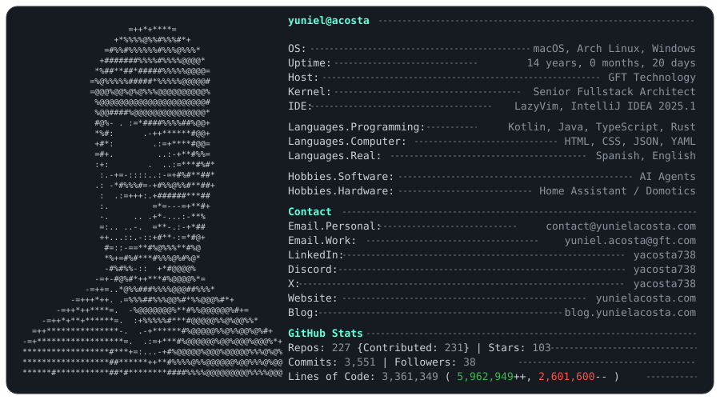

[](https://github.com/yacosta738)
[](https://git.io/typing-svg)

<picture>
  <source media="(prefers-color-scheme: dark)" srcset="assets/profile-card-dark.svg" />
  <source media="(prefers-color-scheme: light)" srcset="assets/profile-card-light.svg" />
  
</picture>

With over 8 years of experience in software development, I specialize in front-end and back-end technologies. I have a strong passion for technology and science, and have gained a deep understanding of software design principles, design patterns, object-oriented programming, functional programming, domain-driven design, and microservices. I am a versatile individual who is always eager to learn and ready to take on any challenge, whether it be within my country or abroad. My expertise in the field of software engineering has allowed me to develop a highly sought-after skill set. I am confident in my ability to adapt to new technologies and constantly seek ways to expand my knowledge and expertise.

## 🌐 Socials:
[](https://discord.gg/yacosta738) [](https://facebook.com/yacosta738) [](https://instagram.com/yacosta738) [](https://linkedin.com/in/yacosta738) [](https://pinterest.com/yacosta738) [](https://reddit.com/user/yacosta738) [](https://stackoverflow.com/users/9894376) [](https://tiktok.com/@yacosta738) [](https://twitch.tv/yacosta738) [](https://x.com/yacosta738) [](https://codepen.io/yacosta738) 

<!--START_SECTION:waka-->


**I'm an Early 🐤** 

```text
🌞 Morning                52395 commits       ██████░░░░░░░░░░░░░░░░░░░   25.13 % 
🌆 Daytime                69742 commits       ████████░░░░░░░░░░░░░░░░░   33.44 % 
🌃 Evening                72893 commits       █████████░░░░░░░░░░░░░░░░   34.96 % 
🌙 Night                  13501 commits       ██░░░░░░░░░░░░░░░░░░░░░░░   06.47 % 
```


📊 **This Week I Spent My Time On** 

```text
💬 Programming Languages: 
Markdown                 14 hrs 50 mins      ███████░░░░░░░░░░░░░░░░░░   26.13 % 
Kotlin                   10 hrs 27 mins      █████░░░░░░░░░░░░░░░░░░░░   18.42 % 
Other                    8 hrs 12 mins       ████░░░░░░░░░░░░░░░░░░░░░   14.44 % 
YAML                     6 hrs 42 mins       ███░░░░░░░░░░░░░░░░░░░░░░   11.82 % 
Rust                     3 hrs 46 mins       ██░░░░░░░░░░░░░░░░░░░░░░░   06.64 % 
```

🤖 **AI Coding This Week** 

```text
⏱ AI Coding Time: 56 hrs 14 mins (98.98%)

✍️ 29,193 lines written by AI, 0 lines written by hand (100.0% AI-written)

🔤 696,998,504 Input Tokens, 8,977,436 Output Tokens

💵 $4655.56 Estimated AI Cost This Week

🧠 493 AI Sessions, 1372 AI Prompts

GPT                      26,698 lines        ██████████████████░░░░░░░   70.17 % 
M                        4,615 lines         ███░░░░░░░░░░░░░░░░░░░░░░   12.13 % 
Opencode-Cli             4,363 lines         ███░░░░░░░░░░░░░░░░░░░░░░   11.47 % 
OpenCode                 1,403 lines         █░░░░░░░░░░░░░░░░░░░░░░░░   03.69 % 
Deepseek                 966 lines           █░░░░░░░░░░░░░░░░░░░░░░░░   02.54 % 

🔎 AI Coding Insights:
🤖 AI-Driven — 100.0% of written lines came from AI
📚 Verbose Prompter — average 3,321 characters per prompt
🔁 Iterative Prompter — average 3 prompts per session
🚀 High AI Trust — 0.0% of changed lines were hand-edited
```


<!--END_SECTION:waka-->

<picture>
  <source media="(prefers-color-scheme: dark)" srcset="https://github.com/yacosta738/yacosta738/blob/output/github-snake-dark.svg" />
  <source media="(prefers-color-scheme: light)" srcset="https://github.com/yacosta738/yacosta738/blob/output/github-snake.svg" />
  
</picture>

## 🏆 GitHub Trophies:

<p style="text-align: left;">  </p>


<p style="text-align: left;"> <a href="https://github.com/ryo-ma/github-profile-trophy"></a> </p>

<p style="text-align: left;"> <a href="https://twitter.com/yacosta738" target="blank"></a> </p>


- :satellite: [Some Things I’ve Built](https://www.yunielacosta.com/#projects)

- :memo: I regularly write articles on [my blog](https://www.yunielacosta.com/en/blog)

- :computer: Know about my [work experiences](https://www.yunielacosta.com/#jobs)

## :memo: Blog posts

<!-- BLOG-POST-LIST:START -->
- [Understanding CORS in Web Development](https://blog.yunielacosta.com/2023/04/03/understanding-cors-in-web-development/)
- [OAuth vs OIDC vs SAML: Authentication vs Authorization](https://blog.yunielacosta.com/2023/03/29/understanding-oauth-oidc-and-saml-authentication-vs-authorization/)
- [SOLID Principles Explained for Maintainable Software](https://blog.yunielacosta.com/2023/03/23/solid-principles-explained-building-more-maintainable-and-understandable-software/)
- [[D] The Dependency Inversion Principle](https://blog.yunielacosta.com/2023/03/18/d-the-dependency-inversion-principle/)
- [[I] The Interface Segregation Principle](https://blog.yunielacosta.com/2023/03/17/i-the-interface-segregation-principle/)
- [[L] The Liskov Substitution Principle](https://blog.yunielacosta.com/2023/03/08/l-the-liskov-substitution-principle/)
<!-- BLOG-POST-LIST:END -->

| GitHub Stats  | GitHub Streak           |
| ------- | ---------------- |
|     |  |
|   | |


